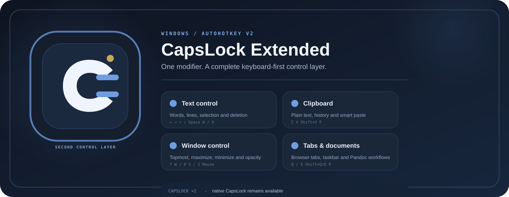

<div align="center">
  

  <p>
    <a href="https://www.autohotkey.com/"></a>
    
    <a href="https://github.com/CYoJkoY/CapsLock-/releases/latest"></a>
    <a href="https://github.com/CYoJkoY/CapsLock-/actions/workflows/release.yml"></a>
    <a href="LICENSE"></a>
  </p>

  <p>
    <a href="https://github.com/CYoJkoY/CapsLock-/releases/latest/download/CapsLock-.exe"><strong>Download x64</strong></a>
    &nbsp;·&nbsp;
    <a href="https://github.com/CYoJkoY/CapsLock-/releases/latest/download/CapsLock-_x86.exe"><strong>Download x86</strong></a>
    &nbsp;·&nbsp;
    <a href="#-installation">Install from source</a>
  </p>
</div>

<div align="center">
  
</div>

## What it is

**CapsLock Extended turns CapsLock into a dedicated modifier layer for Windows.** Hold `CapsLock` and use familiar keys for text navigation, selection, clipboard workflows, window control, tab switching, and optional document conversion.

The idea is deliberately small: keep the physical keyboard unchanged, reserve one rarely-used key as a second command layer, and make frequent desktop actions reachable without leaving the home position.

Built with **AutoHotkey v2**, the project remains modular and local. The native CapsLock state is still available through a double-click.

> [!IMPORTANT]
> **AutoHotkey v2 only.** AutoHotkey v1 is not supported.

## Start here

### The core layer

Every shortcut below uses `CapsLock` as the modifier unless noted otherwise.

| Area | Shortcut | Action |
| :--- | :--- | :--- |
| System | `CapsLock ×2` | Toggle the native CapsLock state |
| Navigation | `Left / Right` | Move one word left / right |
| Navigation | `Up / Down` | Jump to line start / end |
| Selection | `Space` | Select the current word |
| Selection | `Shift + Left / Right` | Extend selection by word |
| Selection | `Shift + Up / Down` | Extend selection to line start / end |
| Editing | `A / D` | Delete one character backward / forward |
| Editing | `Shift + A / D` | Delete one word backward / forward |
| Editing | `Backspace / Delete` | Delete the current line |
| Clipboard | `C` | Copy as plain text and add to history |
| Clipboard | `V` | Paste using the current paste mode |
| Clipboard | `Shift + V` | Open clipboard history |
| Clipboard | `F` | Toggle case of the last copied English text and paste it |
| Documents | `P` | Convert clipboard file paths with Pandoc |
| Window | `T` | Toggle always-on-top with OSD feedback |
| Window | `W / 8 / Num8` | Maximize or restore the active window |
| Window | `S / 2 / Num2` | Minimize the active window |
| Mouse | `Left Button` | Increase active-window opacity |
| Mouse | `Right Button` | Decrease active-window opacity |
| Mouse | `Middle Button` | Toggle 10% / 100% ghost-mode opacity |
| Tabs | `Q / E` | Previous / next browser tab |
| Windows | `Shift + Q / Shift + E` | Previous / next taskbar window |

## Why the modifier layer works

CapsLock Extended groups frequent desktop actions behind one consistent gesture instead of adding new global hotkeys across the keyboard.

### Text

Word-wise navigation, selection expansion, line jumps, deletion, and word selection stay close to the home position.

### Clipboard

The clipboard pipeline supports plain-text copy, configurable paste behavior, clipboard history, case conversion, batch paste, and file-oriented workflows.

### Windows and tabs

The same modifier controls always-on-top, maximize/restore, minimize, opacity, ghost mode, browser tabs, and taskbar window switching.

### Files and documents

Smart paste can validate file paths, expand directories recursively, process image inputs, and manage temporary files. Optional integrations add Pandoc document conversion and ImageMagick image-to-PDF processing.

## Clipboard-first workflows

### Smart paste

`CapsLock + V` uses the configured paste mode. File-oriented workflows can validate paths, expand directories recursively, process images, and place resulting files into the target application.

### Clipboard history

`CapsLock + Shift + V` opens the history interface. Entries can be previewed, searched, selected in batches, pasted, and deleted.

History is stored locally. The current storage layer uses a fixed XOR-based transform, which should be treated as **local data protection rather than strong cryptography**.

### Ignore rules and cleanup

File-based paste workflows support gitignore-style exclusions and configurable temporary-file cleanup, including delayed cleanup, batch cleanup, or disabled automatic deletion.

## Optional integrations

The core modifier layer does not require third-party tools.

### Pandoc

Use Pandoc when you want clipboard file paths converted into a document format.

1. Install Pandoc.
2. Select `pandoc.exe` from the tray settings.
3. Choose an output format.
4. Copy file paths and press `CapsLock + P`.

The current configuration exposes a broad Pandoc format set with `docx` as the default output format.

### ImageMagick

Use ImageMagick for image-to-PDF workflows in the smart-paste pipeline.

1. Install ImageMagick.
2. Select `magick.exe` from the tray settings.
3. Use the image-to-PDF workflow through smart paste.

## Configuration

Configuration is loaded from the runtime `configs` directory and created automatically when needed.

The tray UI exposes settings for:

| Setting | Purpose |
| :--- | :--- |
| ImageMagick | Select or change the ImageMagick executable |
| Pandoc | Select the executable and output format |
| Cleanup | Delayed, batch, or disabled temporary-file cleanup |
| History | Configure clipboard-history retention |
| Paste Mode | Paste as files or text with source information |
| Ignore Rules | Manage gitignore-style exclusions |
| Language | Change the interface language |
| Auto Start | Enable Windows startup integration |
| Reload / Exit | Restart or close the application |

The bundled interface currently supports 13 languages: English, French, Simplified Chinese, Japanese, Korean, Traditional Chinese, Russian, Polish, Spanish, Portuguese, German, Turkish, and Italian.

## Installation

### Recommended: prebuilt executable

Download the latest Windows build from [Releases](https://github.com/CYoJkoY/CapsLock-/releases).

| Build | File |
| :--- | :--- |
| 64-bit Windows | `CapsLock-.exe` |
| 32-bit Windows | `CapsLock-_x86.exe` |

The release workflow builds both targets with AutoHotkey v2 and generates the application icon from [`assets/CapsLock-icon.svg`](assets/CapsLock-icon.svg).

### From source

1. Install **AutoHotkey v2**.
2. Clone or download this repository.
3. Keep `CapsLock-.ahk` alongside its included directories.
4. Run `CapsLock-.ahk` with AutoHotkey v2.
5. Confirm that CapsLock Extended is running in the Windows system tray.

## Architecture

The codebase separates the keyboard layer from supporting subsystems:

```text
CapsLock-/
├── Config/          configuration, globals, local data transform
├── Core/            clipboard, paste, files, cleanup, window utilities, conversions
├── History/         clipboard-history storage and UI
├── Hotkeys/         bindings, actions, and paste handling
├── Tray/            tray menu and settings
├── UI/              user-interface components
├── Utils/           shared utilities
├── assets/          application icon, README visuals, sounds
├── CapsLock-.ahk    entry point
└── lang.csv         interface translations
```

The entry script loads the utility, configuration, core, history, hotkey, tray, and UI modules before initializing language, configuration, history, cleanup, and clipboard handling.

## Release workflow

Releases are created automatically when a `v*.*.*` tag is pushed.

The workflow builds:

- `CapsLock-.exe` — x64
- `CapsLock-_x86.exe` — x86

Before compilation, the workflow runs [`scripts/build_icon.ps1`](scripts/build_icon.ps1), which regenerates `assets/CapsLock-.ico` from the SVG source and then embeds that icon into both executables.

## Security and privacy

CapsLock Extended is a local Windows utility. The core functionality does not require a cloud account or external authentication service.

Clipboard history can contain sensitive text, paths, and files. Review retention and cleanup settings before using the program with confidential data.

The history storage transform is XOR-based with a fixed key. It is **not** intended to protect clipboard contents against a determined local attacker.

When configuring Pandoc or ImageMagick, point the application only at executables you trust.

## Development

The project is plain AutoHotkey v2, so the normal development loop is simple:

```text
edit .ahk modules → run CapsLock-.ahk → test → package through the release workflow
```

When changing shortcuts, keep the user-facing shortcut table synchronized with `Hotkeys/HotkeyBindings.ahk`. When changing runtime settings, update the configuration modules and tray controls together.

Bug reports are most useful when they include the Windows version, AutoHotkey version, affected shortcut or feature, and the exact error message. Do not include private clipboard contents or sensitive local paths.

## Contributing

Good contributions add a clear capability, improve an existing workflow, fix a concrete defect, or reduce complexity without obscuring behavior.

Keep changes focused and modular. For shortcut or setting changes, update the documentation and corresponding implementation together.

## License

CapsLock Extended is licensed under the **GNU General Public License v3.0 (GPL-3.0)**.

See [`LICENSE`](LICENSE) for the complete license text.

## Support

If CapsLock Extended saves you time or improves your workflow, you can support development through the author's payment page:

https://github.com/CYoJkoY/Payment

<div align="center">
  <sub>CapsLock as a second control layer for Windows.</sub>
</div>
