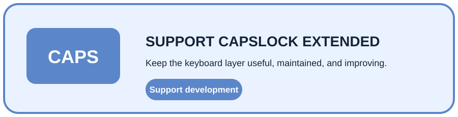

<div align="center">
  
  <h1>CapsLock Extended</h1>
  <p><strong>Turn one rarely-used key into a predictable second control layer for Windows.</strong></p>
  <p>Text navigation · Clipboard · Windows · Tabs · Files · Documents</p>
  <p>
    <a href="https://github.com/CYoJkoY/CapsLock-/releases"></a>
    <a href="https://github.com/CYoJkoY/CapsLock-/actions/workflows/release.yml"></a>
    
    
    <a href="LICENSE"></a>
  </p>
  <p><a href="#overview">Overview</a> · <a href="#shortcut-layer">Shortcuts</a> · <a href="#clipboard-workflows">Workflows</a> · <a href="#configuration">Configuration</a> · <a href="#installation">Install</a> · <a href="#architecture">Architecture</a></p>
</div>

> **Design thesis:** CapsLock is not replaced; it becomes a stable modifier layer. A double press keeps native CapsLock available.

##  Overview

CapsLock Extended is a local Windows utility written in **AutoHotkey v2**. Hold `CapsLock` and use a compact set of combinations for text navigation, selection, editing, clipboard management, windows, browser tabs, and file-oriented workflows.

The modifier stays constant so related actions share one mental model instead of becoming a large collection of unrelated global hotkeys.

**Requirements:** AutoHotkey v2. AutoHotkey v1 is not supported.

##  Shortcut layer

Every shortcut below uses `CapsLock` as the modifier unless noted otherwise.

| Area | Shortcut | Action |
| :--- | :--- | :--- |
| Native key | `CapsLock ×2` | Toggle native CapsLock on / off |
| Navigation | `Left / Right` | Move by word |
| Navigation | `Up / Down` | Jump to line start / end |
| Selection | `Shift + Left / Right` | Extend selection by word |
| Selection | `Shift + Up / Down` | Extend selection to line start / end |
| Selection | `Space` | Select the current word |
| Editing | `A / D` | Delete one character backward / forward |
| Editing | `Shift + A / D` | Delete one word backward / forward |
| Editing | `Backspace / Delete` | Delete the current line |
| Clipboard | `C` | Copy as plain text and add to history |
| Clipboard | `V` | Paste using the current paste mode |
| Clipboard | `Shift + V` | Open clipboard history |
| Clipboard | `F` | Change case of the last copied English text and paste |
| Documents | `P` | Convert clipboard file paths with Pandoc |
| Window | `T` | Toggle always-on-top with OSD feedback |
| Window | `W / 8 / Num8` | Maximize / restore |
| Window | `S / 2 / Num2` | Minimize |
| Window | `Left Button` | Increase active-window opacity |
| Window | `Right Button` | Decrease active-window opacity |
| Window | `Middle Button` | Toggle 10% / 100% ghost mode |
| Tabs | `Q / E` | Previous / next browser tab |
| Windows | `Shift + Q / Shift + E` | Previous / next taskbar window |

##  Clipboard workflows

### Smart paste

`CapsLock + V` follows the configured paste mode. File-oriented paste can validate paths, expand directories recursively, process supported image inputs, and manage temporary files before inserting the result into the target application.

### Clipboard history

`CapsLock + Shift + V` opens the local clipboard-history interface. Entries can be previewed, searched, selected in batches, pasted, or deleted.

History retention is configurable, and automatic cleanup can be enabled for temporary files created during file workflows.

### Case conversion

`CapsLock + F` takes the last copied English text, changes its case, and pastes the result. This is useful for quickly switching identifiers or headings between common casing styles.

##  Optional integrations

The core modifier layer does not require third-party document tools. Two optional integrations extend file and document workflows:

| Tool | Purpose | Shortcut |
| :--- | :--- | :--- |
| **Pandoc** | Convert clipboard file paths into another document format | `CapsLock + P` |
| **ImageMagick** | Extend image-to-PDF processing in smart-paste workflows | Used by image processing workflows |

Configure each executable from the tray settings when needed. Do not point the application to untrusted executables.

## Configuration

Runtime configuration is stored in `configs/Config.ini`, while clipboard history is stored in `configs/ClipHistory.bin`. The directory is created automatically when the application starts.

| Setting | Purpose |
| :--- | :--- |
| Paste mode | Choose text or file-oriented paste behavior |
| Delete mode | Choose delayed, batch, or disabled temporary-file cleanup |
| Delete delay | Set the delay used by delayed cleanup |
| Cleanup interval | Set the automatic cleanup interval |
| Clipboard history | Configure maximum retained history and history-menu size |
| Auto cleanup | Enable or disable periodic cleanup |
| Ignore rules | Add gitignore-style patterns for file workflows |
| ImageMagick | Select `magick.exe` |
| Pandoc | Select `pandoc.exe` |
| Pandoc output | Choose the target conversion format |
| Language | Select the interface language |

The core application stores runtime state locally and does not require a cloud account or authentication service.

##  Installation

### Release build

Download the latest executable from [Releases](https://github.com/CYoJkoY/CapsLock-/releases).

| Build | Artifact |
| :--- | :--- |
| 64-bit Windows | `CapsLock-.exe` |
| 32-bit Windows | `CapsLock-_x86.exe` |

### From source

1. Install **AutoHotkey v2**.
2. Clone or download this repository.
3. Keep `CapsLock-.ahk` beside the included `Config`, `Core`, `History`, `Hotkeys`, `Tray`, `UI`, and `Utils` directories.
4. Run `CapsLock-.ahk` with AutoHotkey v2.
5. Confirm CapsLock Extended is running in the Windows system tray.

##  Architecture

The codebase is split by responsibility:

```text
CapsLock-.ahk
    │
    ├── Config/       persistent settings and runtime state
    ├── Core/         clipboard, paste, files, cleanup, windows, conversion
    ├── History/      clipboard-history storage and UI
    ├── Hotkeys/      shortcut definitions and actions
    ├── Tray/         tray menu and settings controls
    ├── UI/           OSD, preview, and theme helpers
    └── Utils/        shared language, taskbar, dialog, and utility code
```

The main entry point loads language, configuration, and history state, starts optional automatic cleanup, and registers the tray and clipboard handlers.

##  Development

The normal development loop is intentionally simple:

```text
edit .ahk modules → run CapsLock-.ahk → test → package through CI
```

When changing a shortcut, keep the user-facing table synchronized with `Hotkeys/HotkeyBindings.ahk`. When changing a setting, update the configuration module and the corresponding tray controls together.

### Release model

Release builds are triggered by `v*.*.*` tags. GitHub Actions regenerates the application icon and builds x86 and x64 executables with AutoHotkey v2 before publishing both artifacts to the GitHub release.

### Bug reports

Include the Windows version, AutoHotkey version, affected shortcut or feature, and the exact error message. Do not attach clipboard contents, credentials, or sensitive local paths.

<a href="https://cyojkoy.github.io/Payment/"></a>

Development support: **https://cyojkoy.github.io/Payment/**

## Security and privacy

CapsLock Extended is a local desktop utility. Clipboard history can contain sensitive text, file paths, and other private data, so review retention and cleanup settings before using it with confidential information.

The history persistence layer uses a fixed XOR-based transform. This is **obfuscation, not strong cryptography**, and should not be treated as a security boundary against a local attacker.

## License

CapsLock Extended is licensed under the **GNU General Public License v3.0 (GPL-3.0)**.

See [`LICENSE`](LICENSE) for the complete license text.

<div align="center"><sub>CapsLock as a second control layer for Windows.</sub></div>
