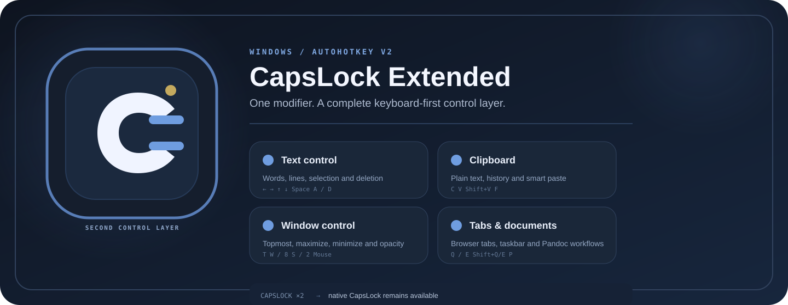
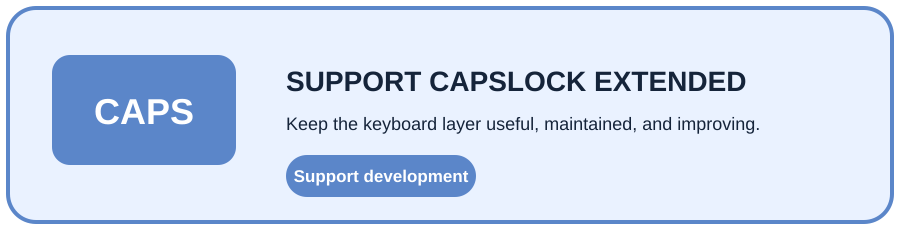

<div align="center">
  
  <h1>CapsLock Extended</h1>
  <p><strong>Turn CapsLock into a predictable second control layer for Windows.</strong></p>
  <p>Text navigation · Clipboard · Windows · Window Hole · Quick Phrases · Documents</p>
  <p>
    <a href="https://github.com/CYoJkoY/CapsLock-/releases"></a>
    <a href="https://github.com/CYoJkoY/CapsLock-/actions/workflows/release.yml"></a>
    
    
    <a href="LICENSE"></a>
  </p>
  <p>
    <a href="#readme-overview">Overview</a> ·
    <a href="#readme-features">Features</a> ·
    <a href="#readme-quick-start">Quick Start</a> ·
    <a href="#readme-development">Development &amp; Status</a> ·
    <a href="#readme-support">Support &amp; License</a>
  </p>
</div>

> **Design thesis:** CapsLock is not replaced. It becomes a modifier layer for related actions, while a double press keeps native CapsLock available.

<a name="readme-overview"></a>

##  Overview

CapsLock Extended is a local Windows productivity utility written in **AutoHotkey v2**. Hold `CapsLock` and use a compact set of combinations for text navigation, selection, editing, clipboard workflows, window management, browser-tab navigation, Quick Phrases, Window Hole, and document conversion.

The project is intentionally centered on one interaction model:

```text
CapsLock
   ├─ text navigation / selection
   ├─ clipboard / paste
   ├─ windows / tabs
   ├─ Quick Phrase templates
   ├─ Window Hole
   └─ document conversion
```

**Requirements**

- Windows
- AutoHotkey v2 for running from source
- Optional ImageMagick and Pandoc for the features that use them

AutoHotkey v1 is not supported.

<a name="readme-features"></a>

##  Features

### Shortcut layer

All bindings below use `CapsLock` as the modifier unless noted otherwise.

Shift-layer shortcuts (`Shift, then W` / `Shift, then S`) use a sequential trigger: press `CapsLock + Shift` first to arm the layer, then press the target key within 2 seconds.

| Category     | Shortcut                   | Action                                                                                                        |
| :----------- | :------------------------- | :------------------------------------------------------------------------------------------------------------ |
| Native       | `CapsLock ×2`              | Toggle the native CapsLock state                                                                              |
| Navigation   | `J`                        | Jump to a specified line                                                                                      |
| Selection    | `Shift + Left / Right`     | Extend selection by word                                                                                      |
| Selection    | `Shift + Up / Down`        | Extend selection to line start / end                                                                          |
| Selection    | `Space`                    | Select the current word                                                                                       |
| Editing      | `A / D`                    | Delete one character backward / forward                                                                       |
| Editing      | `Shift + A / Shift + D`    | Delete one word backward / forward                                                                            |
| Editing      | `Backspace / Delete`       | Delete the current line                                                                                       |
| Clipboard    | `C`                        | Copy as plain text and add it to history                                                                      |
| Clipboard    | `V`                        | Paste using the current paste mode                                                                            |
| Clipboard    | `Shift + V`                | Open the clipboard history menu                                                                               |
| Clipboard    | `F`                        | Change the case of the last copied text and paste it                                                          |
| Quick Phrase | `Shift + P`                | Open the Quick Phrase selector                                                                                |
| Documents    | `P`                        | Convert clipboard file paths with Pandoc                                                                      |
| Files        | `Alt + Q`                  | Open the temporary folder used by file workflows                                                              |
| Window       | `T`                        | Toggle always-on-top with a persistent pin badge                                                              |
| Window       | `K`                        | Terminate a process by PID after confirmation                                                                 |
| Window       | `L`                        | Search and activate an open window                                                                            |
| Window       | `W / 8 / Num8`             | Maximize / restore                                                                                            |
| Window       | `S / 2 / Num2`             | Minimize                                                                                                      |
| Window       | `Shift, then W / 8 / Num8` | Toggle borderless fullscreen                                                                                  |
| Window       | `Shift, then S / 2 / Num2` | Hide the active window to the tray                                                                            |
| Window       | `Left Button`              | Increase active-window opacity                                                                                |
| Window       | `Right Button`             | Decrease active-window opacity                                                                                |
| Window       | `Middle Button`            | Toggle 10% / 100% ghost mode                                                                                  |
| Window Hole  | `X`                        | Activate Window Hole according to the configured activation mode                                              |
| Window Hole  | `X`, then `1`              | Temporarily minimize the current focused window and reveal the next layer; repeat while Window Hole is active |
| Screen       | `O`                        | Spotlight: dim everything except the area around the cursor                                                    |
| Screen       | `Z`                        | Dynamic Zoom: zoom the whole screen around the cursor                                                          |
| Browser tabs | `Q / E`                    | Previous / next browser tab                                                                                   |
| Help         | `H / F1`                   | Open the built-in hotkey reference                                                                            |

The built-in reference is also available from the tray UI and is intended to stay aligned with `Hotkeys/HotkeyReference.ahk`.

### Clipboard and smart paste

**Plain-text copy**

`CapsLock + C` copies the current selection as text and adds it to local clipboard history.

**Smart paste**

`CapsLock + V` routes the clipboard according to the configured paste mode. File-oriented workflows can handle single files, multiple files, directories, mixed paths, text-oriented controls, and supported image inputs.

**Clipboard history**

`CapsLock + Shift + V` opens the history menu. The full history interface supports search, multi-selection, batch operations, deletion, and paginated loading.

History retention is configurable. Automatic trimming can also be enabled for long-running installations.

### Quick Phrases

`CapsLock + Shift + P` opens a local searchable phrase selector.

Templates may contain variables such as:

```text
Please summarize {{topic}} for {{audience}} in {{language}}.
```

When a phrase is used:

1. Unique placeholders are detected in first-appearance order.
2. Each placeholder is requested once.
3. The completed text can be reviewed before insertion.
4. Confirming inserts the result into the application that was focused before the selector opened.

Templates without placeholders are inserted directly.

Phrase data is stored locally under:

```text
configs/
├── QuickPhrases.ini
├── QuickPhrases/
└── CloudSync/
    ├── state.ini
    ├── base.json
    ├── credentials.dat
    ├── backups/
    └── conflicts/
    └── phrase template files
```

The tray manager provides phrase creation, editing, deletion, categories, and ordering. The shortcut can be disabled without deleting the phrase library.

### Window Hole

`CapsLock + X` provides a temporary window-penetration mode.

The current implementation uses a native Win32 window region rather than a visual blur effect:

- the configured hole is cut from an eligible top-level window;
- the revealed lower window remains directly visible through the removed region;
- the hole follows the pointer while the mode is active;
- supported shapes are **circle**, **rounded rectangle**, and **square**;
- activation can be **hold** or **toggle**;
- while Window Hole is active, pressing `1` temporarily minimizes the current focused window, and repeated presses can traverse deeper window layers;
- incompatible windows can optionally use a temporary minimize fallback;
- executable and window-class allow/exclude rules can restrict eligible windows.

The default Window Hole settings are:

| Setting           | Default  |
| :---------------- | :------- |
| Diameter          | `360 px` |
| Shape             | `circle` |
| Activation        | `hold`   |
| Fallback minimize | enabled  |
| Update interval   | `30 ms`  |

Releasing the mode restores the affected windows to their captured visual and window state.

### Spotlight

`CapsLock + O` turns Spotlight on and off (or holds it while the key is down, depending on the
configured activation mode). It draws a screen-sized translucent layer over every monitor and keeps a
clear region centred on the physical cursor, so the area you are pointing at stays bright while the
rest of the desktop remains readable through the dim layer.

- The clear region follows the cursor continuously and works across monitors.
- Radius, edge softness, dim opacity, shape (circle / rounded rectangle / square), and activation mode
  are configurable from the Spotlight sub-menu in the tray.
- Softness `0` gives a hard edge. Any other value feathers the boundary; the gradient is pre-rendered
  once per configuration change and then only moved, so a soft edge does not cost extra per frame.
- Both overlay windows are click-through and cannot take focus, so mouse and keyboard input keeps
  reaching the applications underneath. No window below the overlay is modified, and turning the
  effect off simply removes the overlays.
- Spotlight and Dynamic Zoom cover the same pixels, so starting one stops the other.

### Dynamic Zoom

`CapsLock + Z` turns the whole screen into a magnified view of the desktop around the physical cursor.

- At magnification `n` the screen shows only the `n`-th part of the desktop that surrounds the
  pointer: the ring of content immediately around it, `n` times bigger. At the default factor of 3
  the screen shows a third of the desktop in each direction.
- The pointer keeps its exact position on screen and the magnified image of the desktop point under it
  stays under it, so what you aim at is what you click. No pointer warping and no input transform are
  involved.
- The view shows a **live** desktop, not a screenshot, so video, animation, scrolling text and
  anything else that changes keeps updating while the cursor is still.
- Magnification (`2`-`16`), activation mode (hold / toggle) and the cursor tracking interval are
  configurable from the Dynamic Zoom sub-menu in the tray.
- The overlay is click-through and cannot take focus, so the applications underneath keep receiving
  mouse and keyboard input normally. No window below the overlay is modified, and turning the effect
  off simply removes the overlay.
- The view never takes a copy of the screen, so turning it off cannot leave a stale frame behind.
- Dynamic Zoom and Spotlight cover the same pixels, so starting one stops the other.

**Implementation note.** Dynamic Zoom uses the Windows Magnification API rather than a
`GetDC(NULL)` + `StretchBlt` capture loop. The overlay covers the screen, so the source rectangle lies
entirely inside the overlay: a plain screen capture would sample the overlay window itself and feed it
straight back into the view. The Magnification API is a live view onto the composed desktop and can
exclude the effect's own window via `MagSetWindowFilterList()`, which removes the feedback loop, lets
the compositor do the scaling, and means an idle cursor costs nothing. A magnifier control covers the
virtual screen and `MagSetWindowSource()` is pointed at the region to show; its top-left corner is
pinned to the cursor (`sourceLeft = cursor - (cursor - viewLeft) / factor`) so the pointer never moves
relative to the content underneath it. It requires Windows 8 or later; on older systems the effect
reports that it is unavailable instead of starting.

### Window and tab controls

CapsLock also acts as a compact window-control layer:

- `T` toggles always-on-top and reports the state through OSD and sound feedback. A pinned window also keeps a
  small click-through pin badge on its title bar, so the pinned and unpinned states stay distinguishable after the
  toast disappears. The badge follows the window when it moves, resizes, is minimized, or is dragged to another
  monitor, is scaled to the window's DPI, and disappears on its own if anything else clears the top-most style.
  Pinned windows are also listed under Always-on-top in the tray menu, where a click unpins one; the badge itself
  can be turned off from the same sub-menu.
- `W`, `8`, and `Num8` maximize or restore the active window.
- `S`, `2`, and `Num2` minimize the active window.
- `Shift`, then `W`, `8`, or `Num8` removes the window frame and resizes the active window to the full rectangle of its monitor, which also covers the taskbar. Pressing the same sequence again restores the recorded style, position, size, maximize state, and top-most state, so the switch is always reversible.
- `Shift`, then `S`, `2`, or `Num2` hides the active window to the tray. The application keeps running and stays reachable: hidden windows are listed under Hidden windows in the CapsLock- tray menu, where one click restores a window and Restore all hidden windows brings every hidden window back.
- Both shift-layer actions use a sequential trigger: press and hold `CapsLock + Shift` to activate the shift layer (a 2-second window), then press the target key. This avoids key-conflict issues on certain keyboard layouts where simultaneous `CapsLock + Shift + letter` combinations could not be detected reliably.
- The mouse-button bindings adjust active-window opacity; the middle button switches between normal and 10% ghost mode.
- `Q` and `E` switch browser tabs using the corresponding `Ctrl+PgUp` / `Ctrl+PgDn` actions.
- `L` opens a searchable window switcher that lists application icons, window titles, and process names.
- Both window modes are undone automatically when CapsLock- exits or reloads, so a window is never left frameless or unreachable.

The switcher stays keyboard-first: type to filter, use `Up` / `Down` / `PageUp` / `PageDown` to move through results, and press `Enter` or double-click to activate. Its presentation is configurable from the tray: application icons, icon size, row density, the process column, and selected-row highlighting.

Windows can also be closed from the switcher: a small close button sits at the right edge of every row, and the bottom bar offers the same action for the selected row. Closing uses a graceful `WM_CLOSE` first; if the window does not respond, the switcher asks before ending the process, so unsaved work is not discarded silently.

### Document conversion

`CapsLock + P` converts clipboard file paths through **Pandoc**.

The integration supports a broad list of Pandoc input/output formats, expands folders recursively, applies the configured ignore rules, and provides progress feedback for batch processing.

### Optional ImageMagick integration

ImageMagick is used for image-to-PDF workflows when required by smart paste.

It is optional; the core application remains usable without it.

### Localization

The project ships a CSV-based translation resource with **13 interface languages**:

```text
en · fr · zh · ja · ko · zh_TW · ru
pl · es · pt · de · tr · it
```

Language selection is available from the tray. Translation caches are generated locally from `lang.csv`.

### Theme

Two interface themes ship with the application and are selectable from the tray settings:

| Theme | Notes                                                                                               |
| :---- | :-------------------------------------------------------------------------------------------------- |
| Dark  | Default. Existing dark appearance.                                                                  |
| Light | Low-glare light palette: main surfaces stay in the `#F2F3F5`–`#F6F7F9` range instead of pure white. |

Both themes are defined by a single palette each, so shared UI surfaces (tray menus and submenus, OSD, Quick Phrase UI, settings windows, headers, and transient surfaces) follow the selected theme without per-window colours. Open windows pick up a newly selected theme the next time they are opened.

<a name="readme-quick-start"></a>

##  Quick Start &amp; Configuration

### Download a release

Download the latest executable from [GitHub Releases](https://github.com/CYoJkoY/CapsLock-/releases).

| Artifact              | Target                                              |
| :-------------------- | :-------------------------------------------------- |
| `CapsLock-.exe`       | Windows x64                                         |
| `CapsLock-_x86.exe`   | Windows x86                                         |
| `CapsLockSharp.dll`   | Optional C# services, also embedded in both EXE      |

Release builds are produced by GitHub Actions from version tags matching `v*.*.*`.
Both executables package the optional C# backend (see below); they stay pure
AutoHotkey until it is switched on.

### Run from source

1. Install AutoHotkey v2.
2. Clone or download this repository.
3. Keep `CapsLock-.ahk` together with the repository's source directories.
4. Run `CapsLock-.ahk`.
5. Confirm the CapsLock- tray icon is visible.

The application creates its runtime `configs/` directory automatically.

### Optional integrations

#### ImageMagick

Install ImageMagick and configure `magick.exe` from the tray menu when image-to-PDF conversion is needed.

#### Pandoc

Install Pandoc and configure `pandoc.exe` from the tray menu when document conversion is needed. The same tray submenu controls the output format.

#### C# backend (optional)

A resident history index, history search and batched ignore-rule filtering can run
in .NET instead of AutoHotkey. It is **off by default** and every path keeps a real
AutoHotkey fallback behind a circuit breaker.

Turn it on with one click in **Settings Center → General → System & Runtime → “Set
Up C# Backend”**, next to the backend selector. The button unpacks the files that
release builds already carry (or builds/downloads them in a source checkout),
switches the backend and then verifies the result with one real managed call. The
status line beside it reports whether the backend is active, installed, bundled,
or missing.

Release executables contain the services assembly and the pinned AHK# bridge as
resources and unpack them on first use, so no compiler or download is needed on an
end-user machine. `scripts\build.ps1` reproduces such a build locally, and
`scripts\Setup-CSharpBackend.ps1` provisions a source checkout the same way the
one-click setup does. Setup, diagnostics and measurements:
[`docs/perf/csharp-boundary.md`](docs/perf/csharp-boundary.md).

### Configuration files

Runtime configuration is kept outside the source modules:

```text
configs/
├── Config.ini
├── ClipHistory.bin
├── QuickPhrases.ini
└── QuickPhrases/
```

The application creates this directory automatically. Cloud Sync remains opt-in; without an enabled and configured provider, the application stays entirely local. The CloudSync directory contains synchronization metadata, encrypted local credentials, backups, conflicts, and staging state. These files are not uploaded as a directory.

Important configuration areas include:

| Area               | Purpose                                                                           |
| :----------------- | :-------------------------------------------------------------------------------- |
| `[Cleanup]`        | Delete mode, delete delay, cleanup interval                                       |
| `[History]`        | Clipboard history limit                                                           |
| `[General]`        | Paste mode, auto-clean, language                                                  |
| `[QuickPhrase]`    | Quick Phrase enable/disable state                                                 |
| `[Pandoc]`         | Pandoc path and output format                                                     |
| `[WindowHole]`     | Diameter, shape, activation, update interval, fallback, executable/class rules    |
| `[WindowSwitcher]` | Application icons, icon size, row density, process column, selected-row highlight |
| `[UI]`             | Interface theme (`dark` / `light`)                                                |
| `[Ignore]`         | Gitignore-style path/file patterns                                                |

Most settings are intentionally exposed through the tray rather than requiring manual INI editing.

### Cloud Sync

Cloud Sync is optional and disabled by default. Normal local use does not require a CapsLock account or a cloud provider.

Current provider adapters:

- GitHub Gist
- GitHub Private Repository
- Google Drive
- OneDrive
- WebDAV

Only intentionally syncable configuration and Quick Phrase data are included in the sync package. Clipboard history, transient runtime state, window handles, temporary files, and provider credentials are excluded.

Cloud Sync uses a versioned JSON package with integrity verification, a device identity, local synchronization state, conflict detection, three-way merging, and transactional local replacement with backups.

Provider credentials and OAuth refresh tokens are stored locally with Windows DPAPI and are never placed in the synchronization payload.

### Configuration defaults

The current code defines these notable defaults:

```text
History limit             10,000 entries
Delete mode               1 (delayed)
Delete delay              10 seconds
Cleanup interval          30 seconds
Paste mode                1
Auto history trim         disabled
Quick Phrase              enabled
Window Hole diameter      360 px
Window Hole shape         circle
Window Hole activation    hold
Window Hole fallback      enabled
Window switcher icons     enabled
Window switcher icon      24 px
Window switcher density   normal
Window switcher process   shown
Theme                    dark
```

The interface language is initialized by the language system and may be persisted in `[General]`. The theme is persisted in `[UI]`.

### Security and privacy

Clipboard history is local data and may contain sensitive text, file paths, or application-specific content.

The history persistence layer applies a fixed XOR-based transform. This is **obfuscation, not strong cryptography**, and it should not be treated as protection against a local attacker.

For stronger protection, rely on Windows storage protections such as BitLocker or EFS around the relevant data rather than treating the built-in transform as a cryptographic boundary.

<a name="readme-development"></a>

##  Development &amp; Status

### Project structure

```text
CapsLock-/
├── .github/
│   ├── ISSUE_TEMPLATE/
│   └── workflows/
│       ├── release.yml
│       └── test.yml
├── Config/
├── Core/
├── History/
├── Hotkeys/
├── Tray/
├── UI/
├── Utils/
├── assets/
├── scripts/
├── CapsLock-.ahk
├── lang.csv
├── LICENSE
└── README.md
```

The entry script wires the project modules together and initializes language, configuration, clipboard history, Quick Phrases, cleanup, tray handling, and clipboard listeners.

The main functional boundaries are:

| Directory  | Responsibility                                                                    |
| :--------- | :-------------------------------------------------------------------------------- |
| `Config/`  | Persistent application state and configuration                                    |
| `Core/`    | Clipboard, file, cleanup, Pandoc, Quick Phrase, Window Hole, and window utilities |
| `History/` | Clipboard history storage and interfaces                                          |
| `Hotkeys/` | User-facing keyboard bindings and action routing                                  |
| `Tray/`    | Tray menus and settings                                                           |
| `UI/`      | Theme palettes, OSD, Quick Phrase UI, preview, and shared theme helpers           |
| `Utils/`   | Language and shared utility functions                                             |
| `scripts/` | Build-time helper scripts                                                         |

### Architecture

CapsLock Extended keeps the keyboard layer, feature logic, state, and UI separated:

```text
CapsLock-.ahk
   │
   ├── Hotkeys ───────► actions
   ├── Core ──────────► feature logic
   ├── Config ────────► persistent state
   ├── History ───────► clipboard persistence / UI
   ├── Tray ──────────► configuration controls
   └── UI / Utils ────► presentation + shared services
```

This modular layout is intended to make individual features easier to change without turning the entry script into a monolith.

### Testing and release automation

The repository includes GitHub Actions for:

- source/build validation through `.github/workflows/test.yml`;
- .NET service build/test plus a packaged-EXE probe through `.github/workflows/dotnet.yml`;
- tagged x86/x64 release builds through `.github/workflows/release.yml`.

Release compilation currently uses **AutoHotkey v2.0.28** through the configured AHK build
action. Before compiling, the workflow provisions the optional C# backend and generates the
compiler-directive include that embeds it, then verifies that the finished executables really
carry both resources, so a release can never ship an executable that silently lost its payload.

An alternative release compiler is under evaluation. Nothing about the shipped
artifacts changes until the measurements in
[`docs/build/compiler-evaluation.md`](docs/build/compiler-evaluation.md) justify it.
That document deliberately carries no results: it is a harness, and the numbers
have to be produced on real hardware.

An **optional C# backend (AHK#)** now provides a resident history duplicate index,
text/preview search, and batched ignore-rule filtering. History snapshots cross
once, followed by small deltas; the history GUI formats only visible rows. Hotkeys,
clipboard ownership, GUIs, native file enumeration and persistence stay in
AutoHotkey. The default remains pure AHK, with a circuit breaker and real AHK
fallbacks. On a Windows CI runner the history paths measured 4-80x faster than
their AHK equivalents and ignore-rule filtering only about 1.2x; desktop and
whole-process measurements are still outstanding. Setup, regression checks and the
measurements are in [`docs/perf/csharp-boundary.md`](docs/perf/csharp-boundary.md).

### Project status

The current implementation is centered on local Windows productivity workflows. Two larger features are explicitly planned but **not part of the shipped feature set yet**:

| Roadmap item                                                                   | Status      |
| :----------------------------------------------------------------------------- | :---------- |
| [Custom low-glare light theme](https://github.com/CYoJkoY/CapsLock-/issues/41) | Planned     |
| [Optional cloud sync](https://github.com/CYoJkoY/CapsLock-/issues/42)          | In progress |

Cloud Sync is intended to remain optional; normal local use should not depend on a hosted CapsLock service.

### Known development considerations

Window Hole is a comparatively low-level feature because it interacts with native Win32 window regions, DWM attributes, hit testing, focus, and temporary window state. Changes in that area should be tested against overlapping windows, drag-and-drop, multiple DPI/scaling configurations, and special Windows applications.

Translation changes should be made in `lang.csv` and then checked through the generated language-cache path used by the application.

Shortcut changes should keep these sources synchronized:

```text
Hotkeys/HotkeyBindings.ahk
        ↓
Hotkeys/HotkeyReference.ahk
        ↓
built-in reference UI + README shortcut table
```

<a name="readme-support"></a>

##  Support &amp; License

### Support

CapsLock Extended is maintained as a local, modular utility. Support helps sustain ongoing maintenance, debugging, documentation, localization, and feature work.

<div align="center">
  <a href="https://cyojkoy.github.io/Payment/">
    
  </a>
  <p><strong>Support:</strong> https://cyojkoy.github.io/Payment/</p>
</div>

### Bug reports and feature requests

Use GitHub Issues for reproducible bugs and focused feature requests.

For a useful bug report, include the Windows version, AutoHotkey version, affected shortcut or feature, reproduction steps, and the exact error text when available. Do not include clipboard contents, credentials, or other sensitive local data.

### License

CapsLock Extended is licensed under the **GNU General Public License v3.0 (GPL-3.0)**.

See [`LICENSE`](LICENSE) for the complete license text.

<div align="center"><sub>CapsLock as a second control layer for Windows.</sub></div>
